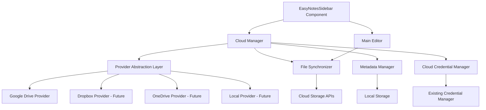

# Design Document

## Overview

The EasyNotes cloud integration feature extends the existing EasyEdit application to support cloud-based note storage and synchronization. The system leverages a modular architecture that integrates with the existing credential management patterns while introducing new components for cloud provider abstraction, file synchronization, and metadata management.

The design follows the existing application patterns, utilizing React components, TypeScript interfaces, and the established credential management system. The architecture supports multiple cloud providers through a common interface, starting with Google Drive and designed for future expansion to Dropbox, OneDrive, Nextcloud, and local folder synchronization.

## Architecture

The cloud notes integration follows a layered architecture:



### Key Architectural Principles

1. **Provider Abstraction**: All cloud providers implement a common interface for consistent behavior
2. **Credential Reuse**: Extends existing GitCredentialManager patterns for secure token storage
3. **Offline-First**: Local metadata enables functionality when cloud services are unavailable
4. **Incremental Sync**: Only synchronizes changed files to minimize bandwidth and API calls
5. **Error Resilience**: Graceful degradation when cloud services are unavailable

## Components and Interfaces

### Core Interfaces

```typescript
interface CloudProvider {
  readonly name: string;
  readonly displayName: string;
  readonly icon: string;
  
  authenticate(): Promise<AuthResult>;
  isAuthenticated(): Promise<boolean>;
  disconnect(): Promise<void>;
  
  createApplicationFolder(): Promise<string>;
  listFiles(folderId: string): Promise<CloudFile[]>;
  downloadFile(fileId: string): Promise<string>;
  uploadFile(folderId: string, fileName: string, content: string): Promise<CloudFile>;
  updateFile(fileId: string, content: string): Promise<CloudFile>;
  deleteFile(fileId: string): Promise<void>;
}

interface CloudFile {
  id: string;
  name: string;
  modifiedTime: Date;
  size: number;
  mimeType: string;
  downloadUrl?: string;
}

interface AuthResult {
  success: boolean;
  accessToken?: string;
  refreshToken?: string;
  expiresAt?: Date;
  error?: string;
}

interface NoteMetadata {
  id: string;
  title: string;
  fileName: string;
  provider: string;
  cloudFileId: string;
  localPath?: string;
  lastModified: Date;
  lastSynced: Date;
  size: number;
  checksum: string;
}
```

### Component Architecture

#### CloudManager
Central orchestrator that coordinates between UI components and cloud providers.

```typescript
class CloudManager {
  private providers: Map<string, CloudProvider>;
  private metadataManager: MetadataManager;
  private fileSynchronizer: FileSynchronizer;
  private credentialManager: CloudCredentialManager;
  
  async connectProvider(providerName: string): Promise<boolean>;
  async disconnectProvider(providerName: string): Promise<void>;
  async createNote(providerName: string, title: string): Promise<NoteMetadata>;
  async listNotes(providerName?: string): Promise<NoteMetadata[]>;
  async openNote(noteId: string): Promise<string>;
  async saveNote(noteId: string, content: string): Promise<void>;
  async deleteNote(noteId: string): Promise<void>;
  async syncNotes(providerName?: string): Promise<SyncResult>;
}
```

#### GoogleDriveProvider
Implements CloudProvider interface for Google Drive integration.

```typescript
class GoogleDriveProvider implements CloudProvider {
  private clientId: string;
  private apiKey: string;
  private scope: string = 'https://www.googleapis.com/auth/drive.file';
  
  async authenticate(): Promise<AuthResult>;
  async refreshToken(): Promise<boolean>;
  private async makeApiCall(endpoint: string, options?: RequestInit): Promise<any>;
}
```

#### MetadataManager
Manages local note metadata for offline access and synchronization tracking.

```typescript
class MetadataManager {
  private metadataFile: string = 'easynotes-metadata.json';
  
  async loadMetadata(): Promise<NoteMetadata[]>;
  async saveMetadata(notes: NoteMetadata[]): Promise<void>;
  async addNote(note: NoteMetadata): Promise<void>;
  async updateNote(noteId: string, updates: Partial<NoteMetadata>): Promise<void>;
  async removeNote(noteId: string): Promise<void>;
  async findNote(noteId: string): Promise<NoteMetadata | null>;
  async findNotesByProvider(provider: string): Promise<NoteMetadata[]>;
}
```

#### FileSynchronizer
Handles file upload, download, and conflict resolution.

```typescript
class FileSynchronizer {
  async downloadNote(provider: CloudProvider, cloudFile: CloudFile): Promise<string>;
  async uploadNote(provider: CloudProvider, folderId: string, fileName: string, content: string): Promise<CloudFile>;
  async updateNote(provider: CloudProvider, fileId: string, content: string): Promise<CloudFile>;
  async syncNote(provider: CloudProvider, metadata: NoteMetadata, localContent?: string): Promise<SyncResult>;
  private calculateChecksum(content: string): string;
  private resolveConflict(localContent: string, cloudContent: string, metadata: NoteMetadata): Promise<string>;
}
```

## Data Models

### Note Metadata Structure
```json
{
  "version": "1.0",
  "lastUpdated": "2024-01-15T10:30:00Z",
  "notes": [
    {
      "id": "note_123456",
      "title": "My First Note",
      "fileName": "my-first-note.md",
      "provider": "googledrive",
      "cloudFileId": "1BxiMVs0XRA5nFMdKvBdBZjgmUUqptlbs74OgvE2upms",
      "localPath": null,
      "lastModified": "2024-01-15T10:25:00Z",
      "lastSynced": "2024-01-15T10:25:30Z",
      "size": 1024,
      "checksum": "sha256:abc123..."
    }
  ],
  "providers": {
    "googledrive": {
      "connected": true,
      "applicationFolderId": "1BxiMVs0XRA5nFMdKvBdBZjgmUUqptlbs74OgvE2upms",
      "lastSync": "2024-01-15T10:25:30Z"
    }
  }
}
```

### Cloud Credentials Structure
Extends existing GitCredentialManager pattern:

```typescript
interface CloudCredentials {
  provider: string;
  accessToken: string;
  refreshToken?: string;
  expiresAt?: Date;
  scope: string;
  userId?: string;
}
```

## Correctness Properties

*A property is a characteristic or behavior that should hold true across all valid executions of a system-essentially, a formal statement about what the system should do. Properties serve as the bridge between human-readable specifications and machine-verifiable correctness guarantees.*

<function_calls>
<invoke name="prework">
<parameter name="featureName">cloud-notes-integration

Based on the prework analysis, I'll consolidate related properties to eliminate redundancy:

**Property Reflection:**
- Properties 1.1-1.5 (authentication flow) can be consolidated into comprehensive authentication properties
- Properties 2.1-2.5 (note creation) can be combined into note creation and sync properties  
- Properties 3.1-3.5 (note listing) can be consolidated into display and sync properties
- Properties 4.1-4.5 (note opening) can be combined into note access properties
- Properties 5.1-5.5 (note saving) can be consolidated into save and sync properties
- Properties 6.1-6.5 (credential management) can be combined into security properties
- Properties 7.1-7.5 (metadata management) can be consolidated into metadata consistency properties

**Property 1: OAuth Authentication Flow**
*For any* cloud provider authentication request, the system should generate a valid OAuth URL, handle the authentication response, and store credentials securely upon success
**Validates: Requirements 1.1, 1.2, 1.3**

**Property 2: Authentication Error Handling**
*For any* authentication failure scenario, the system should display appropriate error messages and provide retry mechanisms without losing user context
**Validates: Requirements 1.4, 1.5**

**Property 3: Note Creation and Cloud Sync**
*For any* valid note title and content, creating a note should result in both cloud storage upload and local metadata update, with the note appearing in the sidebar
**Validates: Requirements 2.1, 2.2, 2.3, 2.5**

**Property 4: Upload Failure Recovery**
*For any* cloud upload failure, the system should maintain local backups, implement retry mechanisms, and preserve user data until successful synchronization
**Validates: Requirements 2.4, 5.3, 5.5**

**Property 5: Note Display Completeness**
*For any* note in the system, the sidebar display should include title, modification date, provider icon, and sync status information
**Validates: Requirements 3.2, 3.5**

**Property 6: Offline Data Access**
*For any* cloud service unavailability, the system should display cached metadata and provide graceful degradation without data loss
**Validates: Requirements 3.4, 7.3**

**Property 7: Note Opening and Editor Integration**
*For any* note selection, the system should download current content, check for conflicts, and integrate with the main editor while indicating cloud source
**Validates: Requirements 4.1, 4.2, 4.3, 4.5**

**Property 8: Download Error Handling**
*For any* download failure, the system should display clear error messages and provide retry options while maintaining application stability
**Validates: Requirements 4.4**

**Property 9: Save Operation Consistency**
*For any* note save operation, the system should upload to cloud storage, update local metadata timestamps, and provide user feedback upon completion
**Validates: Requirements 5.1, 5.2, 5.4**

**Property 10: Credential Security and Management**
*For any* authentication token, the system should encrypt storage, validate expiration, handle refresh operations, and manage multiple providers independently
**Validates: Requirements 6.1, 6.2, 6.3, 6.5**

**Property 11: Credential Cleanup**
*For any* provider disconnection, the system should securely delete all associated credentials and clear cached data completely
**Validates: Requirements 6.4**

**Property 12: Metadata Consistency and Recovery**
*For any* synchronization operation, the system should maintain accurate local metadata, handle corruption through cloud rebuilding, and resolve conflicts by prioritizing cloud data
**Validates: Requirements 7.1, 7.2, 7.4, 7.5**

**Property 13: Provider Interface Compliance**
*For any* cloud provider implementation, all storage operations should conform to the common CloudProvider interface ensuring consistent behavior
**Validates: Requirements 8.1, 8.4**

## Error Handling

### Authentication Errors
- **Network Failures**: Graceful degradation with offline mode and retry mechanisms
- **Invalid Credentials**: Clear error messages with re-authentication prompts
- **Token Expiration**: Automatic refresh with fallback to re-authentication
- **API Rate Limiting**: Exponential backoff with user notification

### File Operation Errors
- **Upload Failures**: Local backup retention with automatic retry
- **Download Failures**: Cached content fallback with error notification
- **Sync Conflicts**: Cloud-first resolution with user notification
- **Storage Quota**: Clear error messages with usage information

### Data Integrity Errors
- **Metadata Corruption**: Automatic rebuilding from cloud sources
- **Checksum Mismatches**: Re-download with integrity verification
- **Partial Uploads**: Transaction-like operations with rollback capability
- **Concurrent Modifications**: Last-writer-wins with conflict notification

## Testing Strategy

The testing approach combines unit testing for specific functionality with property-based testing for universal behaviors across all inputs and scenarios.

### Unit Testing Framework
- **Framework**: Jest with React Testing Library for component testing
- **Coverage**: Component interactions, API integrations, error scenarios
- **Mocking**: Cloud provider APIs, credential storage, file operations
- **Focus**: Specific examples, edge cases, integration points

### Property-Based Testing Framework
- **Framework**: fast-check for TypeScript property-based testing
- **Configuration**: Minimum 100 iterations per property test
- **Coverage**: Universal properties that should hold across all valid inputs
- **Focus**: Authentication flows, file operations, metadata consistency, error handling

### Testing Requirements
- Each correctness property must be implemented by a single property-based test
- Property tests must be tagged with format: `**Feature: cloud-notes-integration, Property {number}: {property_text}**`
- Unit tests complement property tests by covering specific examples and integration scenarios
- Both testing approaches are required for comprehensive coverage

### Test Data Generation
- **Authentication Tokens**: Random valid/invalid token formats
- **Note Content**: Various markdown content including edge cases
- **File Names**: Valid/invalid filename patterns across providers
- **Network Conditions**: Simulated failures, timeouts, rate limiting
- **Metadata States**: Corrupted, missing, conflicting metadata scenarios
