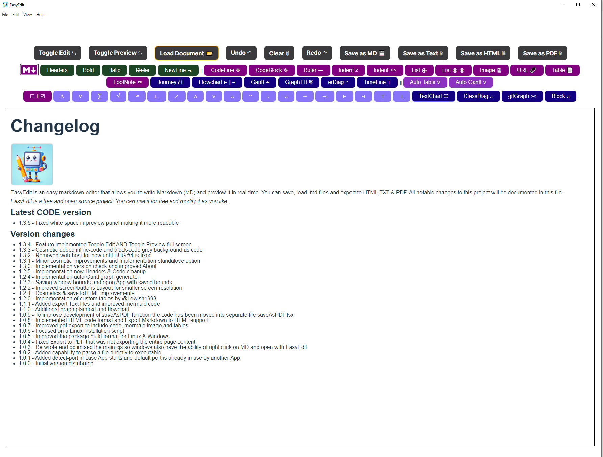
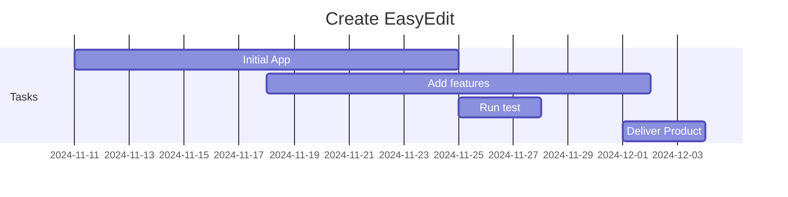

## *EasyEdit*


EasyEdit is an easy markdown editor that allows you to write Markdown (MD) and preview it in real-time. You can save, load .md files and export to HTML,TXT & PDF. The idea is to provide a single MD / Mermaid Aplication that can help creating MD documents by build the MD code as easy as a click of a button.

** *EasyEdit is a free and open-source project. You can use it for free and modify it as you like.* **

## *Latest Example implementing custom tables...*

<a> </a>

## *Install the project*
```
$ node --version
$ npm --version
$ git --version

$ git clone https://github.com/gcclinux/EasyEdit.git
$ cd EasyEdit
$ npm install
```

## *Run the Standalone Project*
```
$ npm start
```

## *Build as an standalone App (Windows & Linux)*
```
$ npm run electron:build
```

## *Pre-built packages*

&#x2713; [Linux ARM64] [EasyEdit-1.3.6c-aarch64.rpm](https://github.com/gcclinux/EasyEdit/releases/download/1.3.6c/EasyEdit-1.3.6c-aarch64.rpm)  [ **[SHA256](## "78e47f952c46e420c2e2158ab2e95cf08a679cbf42e3bcc1642c1d402821e687 ")** ] [
**[MD5](## "ba7f12cd289b12054acbd9dc7fe537ca ")** ]

&#x2713; [Linux x86_64] [EasyEdit-1.3.6c-amd64.snap](https://github.com/gcclinux/EasyEdit/releases/download/1.3.6c/EasyEdit-1.3.6c-amd64.snap)  [ **[SHA256](## "2280f7ec6f245e434ca285f40c80387879a5e3944c691a37c407241157a693e0 ")** ] [
**[MD5](## "e35085142ca22017ff7bc8e51b043077 ")** ]

&#x2713; [Linux ARM64] [EasyEdit-1.3.6c-arm64.AppImage](https://github.com/gcclinux/EasyEdit/releases/download/1.3.6c/EasyEdit-1.3.6c-arm64.AppImage)  [ **[SHA256](## "d2ca81489ac434cf40c2b28097227f7891bc021268574cd68def27cd8434c709 ")** ] [
**[MD5](## "88297b6f863d3ea2aec49a0e4617769f ")** ]

&#x2713; [Linux ARM64] [EasyEdit-1.3.6c-arm64.deb](https://github.com/gcclinux/EasyEdit/releases/download/1.3.6c/EasyEdit-1.3.6c-arm64.deb)  [ **[SHA256](## "7fa9caca43fb875feea82216c4dad47de3b4253a418ce486b1b712dc63143eb9 ")** ] [
**[MD5](## "41279060208a2b85eaee189ffa99b278 ")** ]

&#x2713; [Darwin ARM64] [EasyEdit-1.3.6c-arm64.dmg](https://github.com/gcclinux/EasyEdit/releases/download/1.3.6c/EasyEdit-1.3.6c-arm64.dmg)  [ **[SHA256](## "aa60890ce7e5ad2476d5e7e9b216aead756886fb70c9bb7c78b2346171130d3b ")** ] [
**[MD5](## "f48654919ec3bef1fe668ac9719adb5e ")** ]

&#x2713; [Linux ARM64] [EasyEdit-1.3.6c-arm64.snap](https://github.com/gcclinux/EasyEdit/releases/download/1.3.6c/EasyEdit-1.3.6c-arm64.snap)  [ **[SHA256](## "47109d12da7fd10cb3289e6aa58509a156b75dd5a5d133cef71a2e715abaffef ")** ] [
**[MD5](## "c7016494f075d8ee69297c220ebbb99d ")** ]

&#x2713; [Linux ARM64] [EasyEdit-1.3.6c-arm64.zip](https://github.com/gcclinux/EasyEdit/releases/download/1.3.6c/EasyEdit-1.3.6c-arm64.zip)  [ **[SHA256](## "7d45d51e77caccd972567cb195a84b5811d64268937acfa03b775c397fc69eca ")** ] [
**[MD5](## "c0d5915469239868179828f1cdae41d4 ")** ]

&#x2713; [Linux ARMHF] [EasyEdit-1.3.6c-armhf.snap](https://github.com/gcclinux/EasyEdit/releases/download/1.3.6c/EasyEdit-1.3.6c-armhf.snap)  [ **[SHA256](## "8d53c736a67322bef7b7f9324b8f9db34fde5579fcbf336d1f2fa3ba742518c1 ")** ] [
**[MD5](## "b7019001584f109f5994ea2198a52eca ")** ]

&#x2713; [Linux ARMv7l] [EasyEdit-1.3.6c-armv7l.AppImage](https://github.com/gcclinux/EasyEdit/releases/download/1.3.6c/EasyEdit-1.3.6c-armv7l.AppImage)  [ **[SHA256](## "a8c390a3ea7fadba456ec1c038e4d7b4294565e1eb1dac14a74575eae93882d3 ")** ] [
**[MD5](## "760661999bfdda885db68bda5cd68aaf ")** ]

&#x2713; [Linux ARMv7l] [EasyEdit-1.3.6c-armv7l.deb](https://github.com/gcclinux/EasyEdit/releases/download/1.3.6c/EasyEdit-1.3.6c-armv7l.deb)  [ **[SHA256](## "6f5447f8881a3f8ee4a9192a7e2f1045d3505eac594e50f555f79a6324b6a633 ")** ] [
**[MD5](## "7c48ba5c4cfb492c218297cb477b81bc ")** ]

&#x2713; [Linux ARMv7l] [EasyEdit-1.3.6c-armv7l.rpm](https://github.com/gcclinux/EasyEdit/releases/download/1.3.6c/EasyEdit-1.3.6c-armv7l.rpm)  [ **[SHA256](## "388edcced2a5ad049442915e87ef47a9f3051848e88b20b5b2c739eb93d43e24 ")** ] [
**[MD5](## "e1c2a3ed6428f04f2d6d0a57e2511faf ")** ]

&#x2713; [Linux ARMv7l] [EasyEdit-1.3.6c-armv7l.zip](https://github.com/gcclinux/EasyEdit/releases/download/1.3.6c/EasyEdit-1.3.6c-armv7l.zip)  [ **[SHA256](## "b569d1413f70da512da796a183de20c03e8d5e75e76be4597edda4d09e413821 ")** ] [
**[MD5](## "57c5bb86802b2490c6971720122ee1db ")** ]

&#x2713; [Linux x86_64] [EasyEdit-1.3.6c-x64.zip](https://github.com/gcclinux/EasyEdit/releases/download/1.3.6c/EasyEdit-1.3.6c-x64.zip)  [ **[SHA256](## "d3b182d08356c21706a6a619c0b00d31a5526ee922b251415d83fa8dc585ad65 ")** ] [
**[MD5](## "4a1e1a0b55793d2afc0ce33a003d4b35 ")** ]

&#x2713; [Linux x86_64] [EasyEdit-1.3.6c-x86_64.AppImage](https://github.com/gcclinux/EasyEdit/releases/download/1.3.6c/EasyEdit-1.3.6c-x86_64.AppImage)  [ **[SHA256](## "dd2adfcf8970a3b289f7e6576f282b01d35c4738b13297d7df61b8f93b086a50 ")** ] [
**[MD5](## "88180ba8742fd793261ac12a3fa75568 ")** ]

&#x2713; [Linux x86_64] [EasyEdit-1.3.6c-x86_64.rpm](https://github.com/gcclinux/EasyEdit/releases/download/1.3.6c/EasyEdit-1.3.6c-x86_64.rpm)  [ **[SHA256](## "fbdf7bb312f9963e85f213b406f0c2210498b3764369843b978588783e2b2b17 ")** ] [
**[MD5](## "3b25c82dffc7f58c72fcc098ff2a7b66 ")** ]

&#x2713; [Linux x86_64] [EasyEdit-1.3.6-x64.pacman](https://github.com/gcclinux/EasyEdit/releases/download/1.3.6/EasyEdit-1.3.6-x64.pacman)  [ **[SHA256](## "ea8704db0940c57757c49799dac07512135f926665d6f4dd23e104a1a066640d ")** ] [
**[MD5](## "418bdaa7deed62d068c64751543fbc4f ")** ]

&#x2713; [Windows x86] [EasyEdit-Portable-1.3.6c.exe](https://github.com/gcclinux/EasyEdit/releases/download/1.3.6c/EasyEdit-Portable-1.3.6c.exe)  [ **[SHA256](## "b66069b7e6ec61661b4dd4e038c01fa9e831a4e67c096d0c22f7be57edabb88e ")** ] [
**[MD5](## "11b612e2e4d0541bbd6da21c37ac31d0 ")** ]

&#x2713; [Windows x86] [EasyEdit-Portable-1.3.6c.zip](https://github.com/gcclinux/EasyEdit/releases/download/1.3.6c/EasyEdit-Portable-1.3.6c.zip)  [ **[SHA256](## "2db7707cd6da71bc971c2773f2284c0a94f7f3a22d3cbfa1d622d1f762f7ac69 ")** ] [
**[MD5](## "bbf43fb0e57dc51d1ba67394a709bbee ")** ]

&#x2713; [Windows x86] [EasyEdit-Setup-1.3.6c.exe](https://github.com/gcclinux/EasyEdit/releases/download/1.3.6c/EasyEdit-Setup-1.3.6c.exe)  [ **[SHA256](## "c8768480606bf4d0a428422f9f47e184a4711e57580cef1371a2380b0b8eee06 ")** ] [
**[MD5](## "407bfafb68e5241510ac028c3d5e33ad ")** ]

&#x2713; [Windows x86] [EasyEdit-Setup-1.3.6c.msi](https://github.com/gcclinux/EasyEdit/releases/download/1.3.6c/EasyEdit-Setup-1.3.6c.msi)  [ **[SHA256](## "ea869edc90d477b2106ea7dbe24ba91b63d7a0d4960672bd36ee6040df75948b ")** ] [
**[MD5](## "52ca683ff056b6c6a611627b20bec5ef ")** ]

## *Example Gantt graph as code*


## *Example Table displayed*

| header1 | header2 | header3 |
| :--- | :--- | :--- |
| row1 | col2 | col3 |
| row2 | col2 | col3 |

## *Markdown Image URL Example & code*

[](https://github.com/gcclinux/EasyEdit)

```
[](https://github.com/gcclinux/EasyEdit)
```
