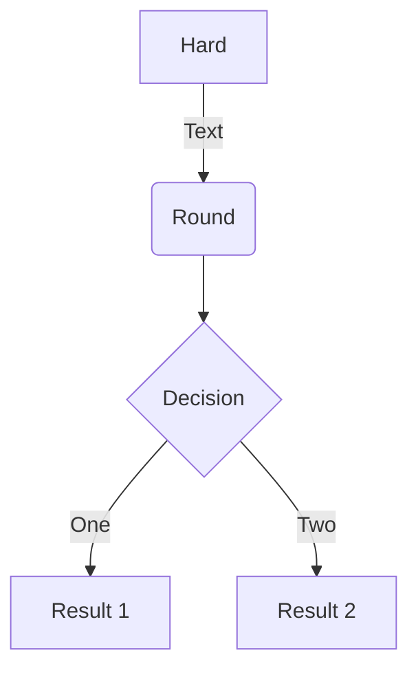

## To install react+vite

```
npm create vite@latest smalltextmd
```

√ Project name: ... smalltextmd
√ Select a framework: » React
√ Select a variant: » TypeScript + SWC

## To install the project

```
cd smalltextmd
npm install
npm install react-markdown remark-gfm file-saver
npm install --save-dev @types/file-saver
```

## To run the project

$ npm run dev
$ npm run prd

Another way is using npm run dev, you can modify the script in your package.json file to include the --port option. Here's how you can do it:

## Example (added line "test": "vite --port 3024",):

```

  "scripts": {
    "test": "vite --port 3024",
    "dev": "export USE_HTTPS=false && vite --port 3024",
    "prd": "export USE_HTTPS=true && vite --port 3024 --host",
    "build": "vite build",
    "lint": "eslint . --ext js,jsx --report-unused-disable-directives --max-warnings 0",
    "preview": "vite preview"
  },

```

Also update the vite.config.ts file to include the option to run in SSL or HTTP

```
// Determine if HTTPS should be used based on an environment variable
const useHttps = process.env.USE_HTTPS === 'true';

export default defineConfig({
  plugins: [react()],
  server: {
    port: 3024,
    host: true,
    ...(useHttps ? {
      https: {
        key: fs.readFileSync(path.resolve(__dirname, '/server/certbot/shared/domain/privkey.pem')),
        cert: fs.readFileSync(path.resolve(__dirname, '/server/certbot/shared/domain/cert.pem')),
        ca: fs.readFileSync(path.resolve(__dirname, '/server/certbot/shared/domain/chain.pem')),
      }
    } : {})
  }
});
```

```

export USE_HTTPS=false; npm run dev
export USE_HTTPS=true; npm run prd

```

## Running in screen Example:

```
$ cd /server/code/smalltextmd && screen -L -Logfile /server/code/tools/logs/SMALLTEXTMD.log -dmS SMALLTEXTMD npm run prd
```

## Mermeid example



- - -