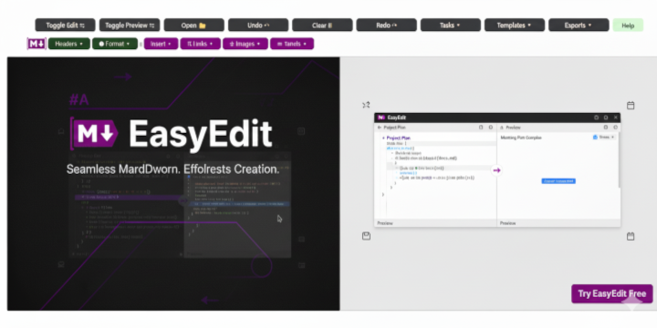
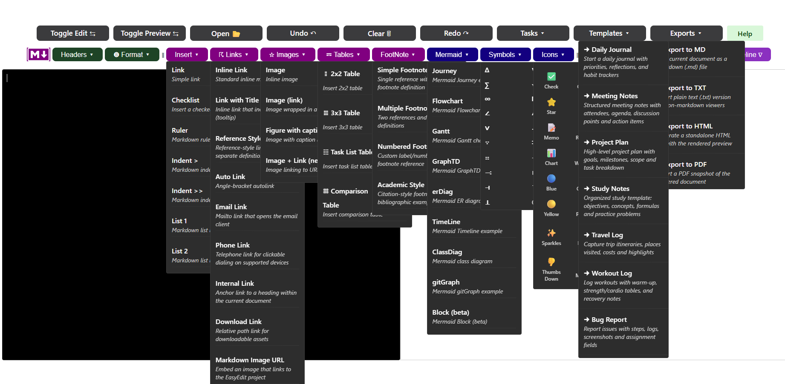
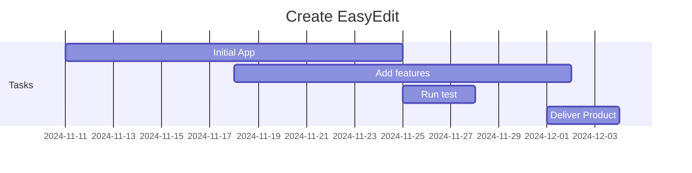

## *EasyEdit*


EasyEdit is an easy markdown editor that allows you to write Markdown (MD) and preview it in real-time. You can save, load .md files and export to HTML,TXT & PDF. The idea is to provide a single MD / Mermaid Aplication that can help creating MD documents by build the MD code as easy as a click of a button.



** *EasyEdit is a free and open-source project. You can use it for free and modify it as you like.* **

## *Try it before Installing it*

[Try EasyEdit](https://easyedit-web.web.app/ "EasyEdit")

## *Install the project*
```
$ node --version
$ npm --version
$ git --version

$ git clone https://github.com/gcclinux/EasyEdit.git
$ cd EasyEdit
$ npm install
```

## *Run the Standalone Project*
```
$ npm run app
```

## *Run the server manually*
```
$ npm run server
```

## *Build as an standalone App (Windows & Linux)*
```
$ npm run electron:build
```

## *Run Pre-built Docker Example*
```
# Docker Hub aarch64
# Pull aarch64
$ docker pull gcclinux/easyedit:1.4.0-aarch64
# Run aarch64
$ docker run -d --name EASYEDIT -p 3024:3024 gcclinux/easyedit:1.4.0-aarch64

# Docker Hub x86_64
# Pull x86_64
$ docker pull gcclinux/easyedit:1.4.0-amd64
# Run x86_64
$ docker run -d --name EASYEDIT -p 3024:3024 gcclinux/easyedit:1.4.0-amd64
```

## *Latest Example implementing Templates and Examples...*

<a></a>

## *Example Gantt graph as code*


## *Example Table displayed*

| header1 | header2 | header3 |
| :--- | :--- | :--- |
| row1 | col2 | col3 |
| row2 | col2 | col3 |

## *Markdown Image URL Example*

[](https://github.com/gcclinux/EasyEdit)


### Solution Exec:
```
./EasyEdit-1.3.7-x86_64.AppImage --no-sandbox
```
