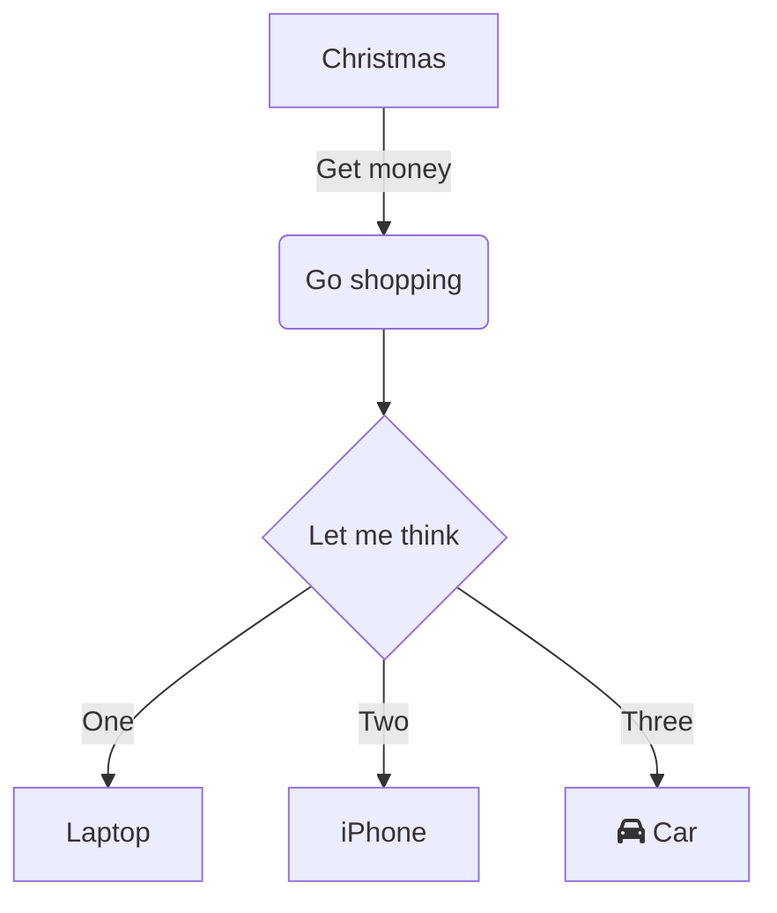
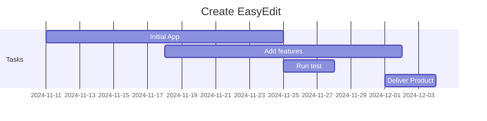

## EasyEdit


EasyEdit is an easy markdown editor that allows you to write Markdown (MD) and preview it in real-time. You can save, load .md files and export to HTML,TXT & PDF. All notable changes to this project will be documented in this file.

*EasyEdit is a free and open-source project. You can use it for free and modify it as you like.*

## Latest Example implementing custom tables...

<a> </a>

## Install the project
```
$ node --version
$ npm --version
$ git --version

$ git clone https://github.com/gcclinux/EasyEdit.git
$ cd EasyEdit
$ npm install
```

## Run the Standalone Project
```
$ npm start
```

## Run Project for localhost OR hosting https
```
$ npm run local
OR
$ npm run prd
```

## Build as an standalone App (Windows & Linux)
```
$ npm run electron:build
```

## Mermeid example



## Gantt graph as code


## Table displayed

| header1 | header2 | header3 |
| :--- | :--- | :--- |
| row1 | col2 | col3 |
| row2 | col2 | col3 |

Example of a footnote[^1] within text.
  [^1]: Description of footnote text