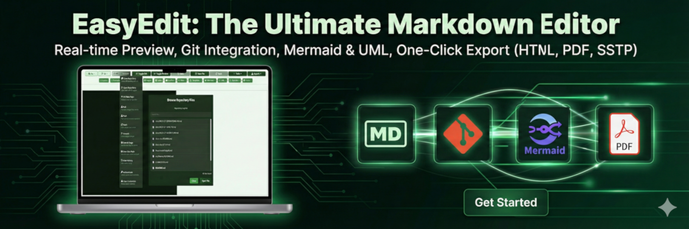
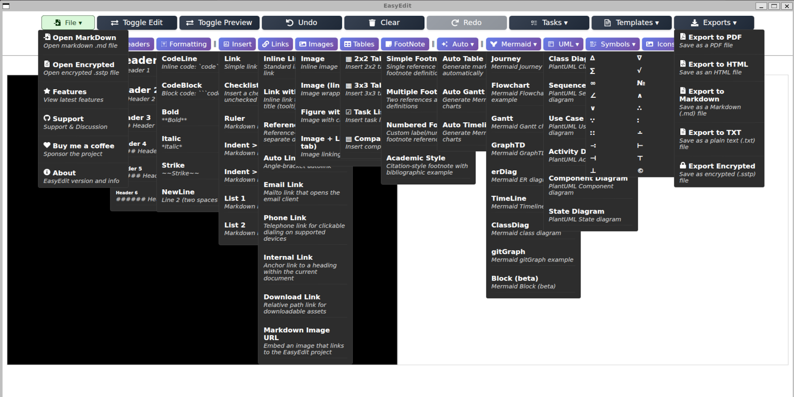
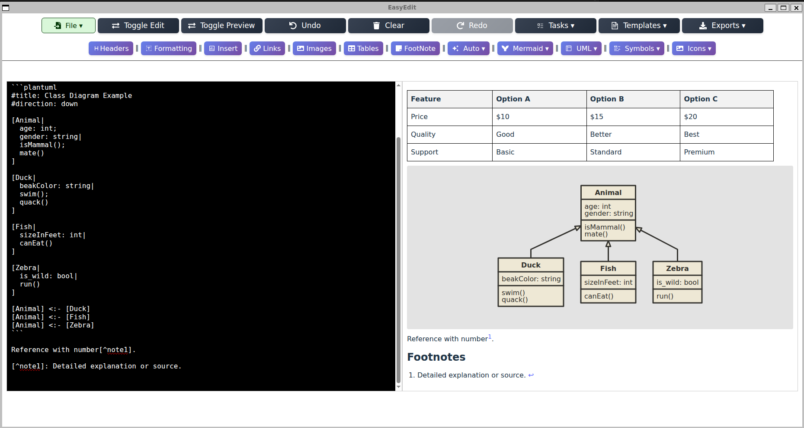
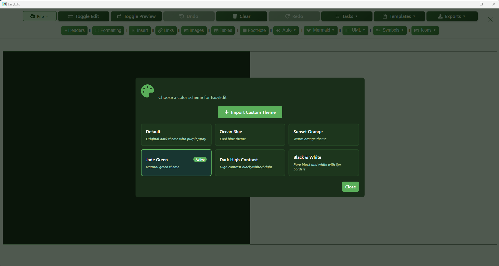

 ## *Easyedit*

Easyedit is an easy markdown editor that allows you to write Markdown (MD) and preview it in real-time. You can save, load .md files, load Git repo and stage,commit, push and export to HTML,TXT, PDF & SSTP Encryption. The idea is to provide a single MD / Mermaid /UML Aplication that can help creating MD documents by build the MD code as easy as a click of a button, with over 130 features & examples.



***EasyEditor is a free and open-source project. You can use it for free and modify it as you like.***

## *Try it before Installing it*

[](https://easyeditor-cloud.web.app/)

## *Install the project*
```
$ node --version
$ npm --version
$ git --version

$ git clone https://github.com/gcclinux/EasyEditor.git
$ cd EasyEditor
$ npm install
```

## *Tauri Desktop App Requirements*

To build and run the Tauri desktop application, you need:

### Prerequisites
```bash
# Install Rust (required for Tauri)
curl --proto '=https' --tlsv1.2 -sSf https://sh.rustup.rs | sh
source ~/.cargo/env

# Verify Rust installation
rustc --version
cargo --version
```

### System Dependencies

**Linux (Ubuntu/Debian):**
```bash
sudo apt update
sudo apt install libwebkit2gtk-4.1-dev \
  build-essential \
  curl \
  wget \
  file \
  libxdo-dev \
  libssl-dev \
  libayatana-appindicator3-dev \
  librsvg2-dev
```

**Linux (Fedora):**
```bash
sudo dnf install webkit2gtk4.1-devel \
  openssl-devel \
  curl \
  wget \
  file \
  libappindicator-gtk3-devel \
  librsvg2-devel
sudo dnf group install "C Development Tools and Libraries"
```

**macOS:**
```bash
# Install Xcode Command Line Tools
xcode-select --install
```

**Windows:**
```powershell
# Install Visual Studio Build Tools for Tauri development
Write-Host "Installing Visual Studio Build Tools..." -ForegroundColor Green

# Download VS Build Tools installer
$url = "https://aka.ms/vs/17/release/vs_buildtools.exe"
$output = "$env:TEMP\vs_buildtools.exe"

Write-Host "Downloading Visual Studio Build Tools..." -ForegroundColor Yellow
Invoke-WebRequest -Uri $url -OutFile $output

Write-Host "Installing Build Tools with C++ workload..." -ForegroundColor Yellow
Write-Host "This may take several minutes..." -ForegroundColor Yellow

# Install with C++ build tools
Start-Process -FilePath $output -ArgumentList @(
    "--quiet",
    "--wait", 
    "--add", "Microsoft.VisualStudio.Workload.VCTools",
    "--includeRecommended"
) -Wait

Write-Host "Build Tools installation completed!" -ForegroundColor Green
Write-Host "You may need to restart your terminal/IDE for changes to take effect." -ForegroundColor Yellow

# Clean up
Remove-Item $output -Force
```

### Build Tauri App
```bash
# Development mode
npm run tauri:dev

# Production build
npm run tauri:build
```

## *Run the Standalone Project*
```
$ npm run app
```

## *Run the server manually*
```
$ npm run server
```

## *Run Pre-built Docker Example*
```
# Latest build automatic on every code submition
$ docker pull ghcr.io/gcclinux/easyeditor:latest
$ docker run -d --name EASYEDITOR -p 3024:3024 ghcr.io/gcclinux/easyeditor:main
```

## *New basic Git enabled feature added*

<a></a>

## *Latest Example implementing Templates and Examples...*

<a></a>

## *Example of UML, table & Footer*

<a></a>

## *Select or create your own Themes*

<a></a>

## *Example Table displayed*

| header1 | header2 | header3 |
| :--- | :--- | :--- |
| row1 | col2 | col3 |
| row2 | col2 | col3 |

---

## *Quick Links*

[](https://gcclinux.github.io/EasyEditor/) 
[](https://gcclinux.github.io/EasyEditor/docs) 
[](https://gcclinux.github.io/EasyEditor/features) 

[](https://gcclinux.github.io/EasyEditor/download) 
[](https://gcclinux.github.io/EasyEditor/webapp/) 
[](https://github.com/gcclinux/EasyEditor/releases) 

[](https://github.com/gcclinux/EasyEditor) 
[](https://github.com/gcclinux/EasyEditor/stargazers) 
[](LICENSE) 

## *Support & Community*

[](https://github.com/gcclinux/EasyEditor/issues)
[](https://github.com/gcclinux/EasyEditor/discussions)
[](https://www.buymeacoffee.com/gcclinux)
