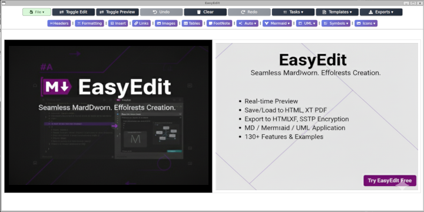

## *EasyEdit*


EasyEdit is an easy markdown editor that allows you to write Markdown (MD) and preview it in real-time. You can save, load .md files, load Git repo and stage,commit, push and export to HTML,TXT, PDF & SSTP Encryption. The idea is to provide a single MD / Mermaid /UML Aplication that can help creating MD documents by build the MD code as easy as a click of a button, with over 130 features & examples.



** *EasyEdit is a free and open-source project. You can use it for free and modify it as you like.* **

## *Try it before Installing it*

[](https://gcclinux.github.io/EasyEdit/webapp/)

## *Install the project*
```
$ node --version
$ npm --version
$ git --version

$ git clone https://github.com/gcclinux/EasyEdit.git
$ cd EasyEdit
$ npm install
```

## *Run the Standalone Project*
```
$ npm run app
```

## *Run the server manually*
```
$ npm run server
```

## *Build as an standalone App (Windows & Linux)*
```
$ npm run electron:build
```

## *Run Pre-built Docker Example*
```
# Latest build automatic on every code submition
$ docker pull ghcr.io/gcclinux/easyedit:main
$ docker run -d --name EASYEDIT -p 3024:3024 ghcr.io/gcclinux/easyedit:main
```

## *Latest Example implementing Templates and Examples...*

<a></a>

## *Example of UML, table & Footer*

<a></a>

## *Select or create your own Themes*

<a></a>

## *Example Table displayed*

| header1 | header2 | header3 |
| :--- | :--- | :--- |
| row1 | col2 | col3 |
| row2 | col2 | col3 |

---

## *Quick Links*

[](https://gcclinux.github.io/EasyEdit/) 
[](https://gcclinux.github.io/EasyEdit/docs) 
[](https://gcclinux.github.io/EasyEdit/features) 

[](https://gcclinux.github.io/EasyEdit/download) 
[](https://gcclinux.github.io/EasyEdit/webapp/) 
[](https://github.com/gcclinux/EasyEdit/releases) 

[](https://github.com/gcclinux/EasyEdit) 
[](https://github.com/gcclinux/EasyEdit/stargazers) 
[](LICENSE) 

## *Support & Community*

[](https://github.com/gcclinux/EasyEdit/issues)
[](https://github.com/gcclinux/EasyEdit/discussions)
[](https://www.buymeacoffee.com/gcclinux)