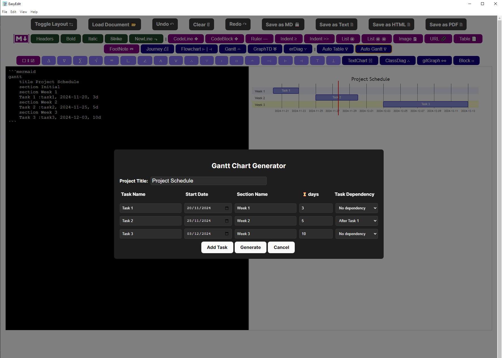
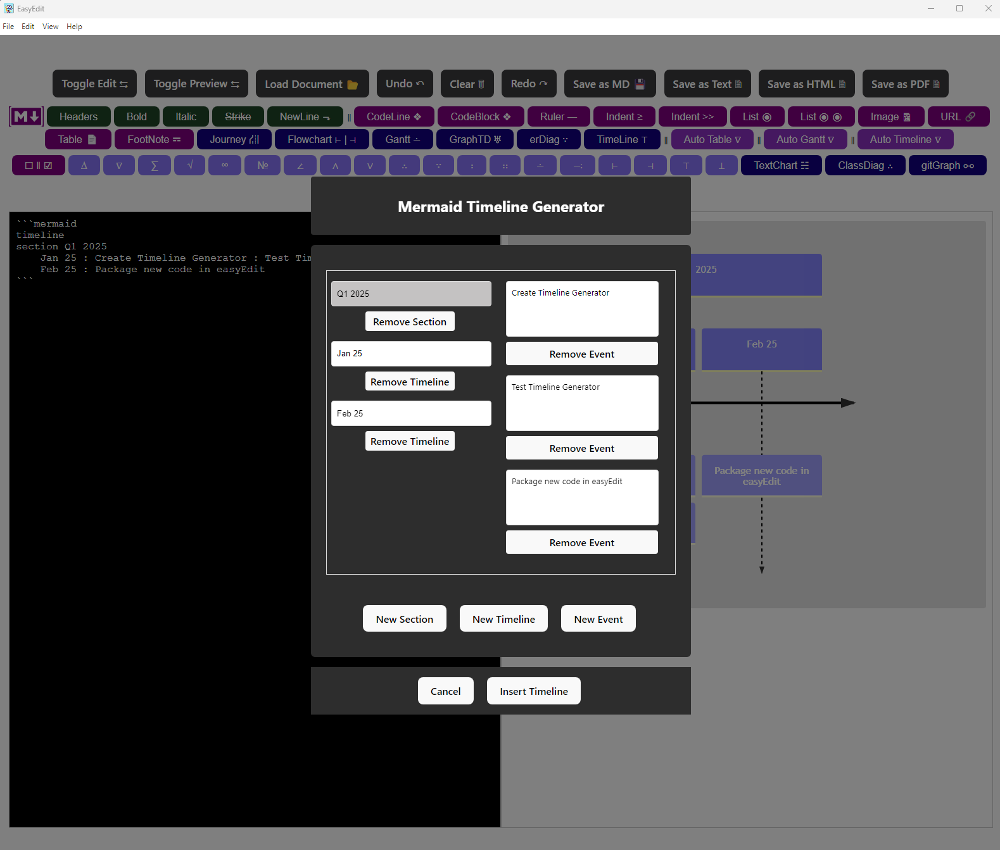
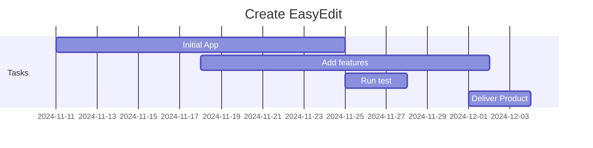

## *EasyEdit*


EasyEdit is an easy markdown editor that allows you to write Markdown (MD) and preview it in real-time. You can save, load .md files and export to HTML,TXT & PDF. The idea is to provide a single MD / Mermaid Aplication that can help creating MD documents by build the MD code as easy as a click of a button.

** *EasyEdit is a free and open-source project. You can use it for free and modify it as you like.* **

## *Latest Example implementing custom tables...*

<a> </a>

## *Install the project*
```
$ node --version
$ npm --version
$ git --version

$ git clone https://github.com/gcclinux/EasyEdit.git
$ cd EasyEdit
$ npm install
```

## *Run the Standalone Project*
```
$ npm run app
```

## *Run the server manually*
```
$ npm run server
```

## *Build as an standalone App (Windows & Linux)*
```
$ npm run electron:build
```

## *Example Gantt graph as code*


## *Example Table displayed*

| header1 | header2 | header3 |
| :--- | :--- | :--- |
| row1 | col2 | col3 |
| row2 | col2 | col3 |

## *Markdown Image URL Example*

[](https://github.com/gcclinux/EasyEdit)


## *Linux it from the Snap Store*
[](https://snapcraft.io/easyedit) 
## *Linux, Mac, Windows it Pre-built packages*

&#x2713; [Linux ARM64] [EasyEdit-1.3.7-aarch64.rpm](https://github.com/gcclinux/EasyEdit/releases/download/1.3.7/EasyEdit-1.3.7-aarch64.rpm)  [ **[SHA256](## "9cd8858b96f774d8325c088d8481f76812261d2a7d7a2119588dab6db8fa7ea9")** ] [ 
**[MD5](## "0c181ce242dcd8176b4babe036dc31d6")** ]

&#x2713; [Linux x86_64] [EasyEdit-1.3.7-amd64.deb](https://github.com/gcclinux/EasyEdit/releases/download/1.3.7/EasyEdit-1.3.7-amd64.deb)  [ **[SHA256](## "29d87c0f6ac67305b79b9b53c92b959d750d5a9f90eae0205dc374cd19fe58c5")** ] [ 
**[MD5](## "8949c7f8e6dc337574bdb4ba9c474a06")** ]

&#x2713; [Linux x86_64] [EasyEdit-1.3.7-amd64.snap](https://github.com/gcclinux/EasyEdit/releases/download/1.3.7/EasyEdit-1.3.7-amd64.snap)  [ **[SHA256](## "6ca02eb89dc882217c2a46bd62cd69b27b6499a92eca9c46476128ce0c8ee65d")** ] [ 
**[MD5](## "9d01d7abd92f56f6bdf491c082055d7f")** ]

&#x2713; [Linux ARM64] [EasyEdit-1.3.7-arm64.AppImage](https://github.com/gcclinux/EasyEdit/releases/download/1.3.7/EasyEdit-1.3.7-arm64.AppImage)  [ **[SHA256](## "55272dd9ae0000e6ca3a415073fc4e74fe9ed532a455323154ca8eac38a7f742")** ] [ 
**[MD5](## "e79cda8db8deda6e375a8afc3cd1f531")** ]

&#x2713; [Linux ARM64] [EasyEdit-1.3.7-arm64.deb](https://github.com/gcclinux/EasyEdit/releases/download/1.3.7/EasyEdit-1.3.7-arm64.deb)  [ **[SHA256](## "8cd5e34f55c2019d40fea18260a445eb71ad1876b3c74f34730ee36cacc3fc64")** ] [ 
**[MD5](## "c5dc509b64b49390644cb3e4f438ae46")** ]

&#x2713; [Darwin ARM64] [EasyEdit-1.3.7-arm64.dmg](https://github.com/gcclinux/EasyEdit/releases/download/1.3.7/EasyEdit-1.3.7-arm64.dmg)  [ **[SHA256](## "a6d229befdfb3f64d295e3b9aca1fb8dca19d462b1135a520ecf77cde21cb925")** ] [ 
**[MD5](## "905abf0ec301ac690d69bcf6583d5a22")** ]

&#x2713; [Linux ARM64] [EasyEdit-1.3.7-arm64.snap](https://github.com/gcclinux/EasyEdit/releases/download/1.3.7/EasyEdit-1.3.7-arm64.snap)  [ **[SHA256](## "437af1d050df3cdb36b8bf2f5fec16a40cbb3a26273ed20b25e8d373bbd76c5c")** ] [ 
**[MD5](## "403dbec981fc0b836332874d0ede72c8")** ]

&#x2713; [Linux ARM64] [EasyEdit-1.3.7-arm64.zip](https://github.com/gcclinux/EasyEdit/releases/download/1.3.7/EasyEdit-1.3.7-arm64.zip)  [ **[SHA256](## "42051d5f88b0d7000e44ede61bf8091a91bfaf54c78faaee06a7b6fccbd78884")** ] [ 
**[MD5](## "3436196441b219f02b6fe18dcbde7185")** ]

&#x2713; [Linux ARMHF] [EasyEdit-1.3.7-armhf.snap](https://github.com/gcclinux/EasyEdit/releases/download/1.3.7/EasyEdit-1.3.7-armhf.snap)  [ **[SHA256](## "072418a1a70a444cbbc8f4a28a4dc17f05f6663aa9c12c84cde666043e18dd30")** ] [ 
**[MD5](## "a5ba074c2aafa280921713126d2acf8a")** ]

&#x2713; [Linux ARMv7l] [EasyEdit-1.3.7-armv7l.AppImage](https://github.com/gcclinux/EasyEdit/releases/download/1.3.7/EasyEdit-1.3.7-armv7l.AppImage)  [ **[SHA256](## "402e349e540bea9705a6750222dd82688ccd9a33512412b26913a3e4e741d9d0")** ] [ 
**[MD5](## "783a871193743714b4e5b37822c4d5e0")** ]

&#x2713; [Linux ARMv7l] [EasyEdit-1.3.7-armv7l.deb](https://github.com/gcclinux/EasyEdit/releases/download/1.3.7/EasyEdit-1.3.7-armv7l.deb)  [ **[SHA256](## "7b988133808b30f9c4b17de1746367bdf857ecece9589327b98c00ab7f190b90")** ] [ 
**[MD5](## "4d11afcf6cc13a6c5a14d59bee59b263")** ]

&#x2713; [Linux ARMv7l] [EasyEdit-1.3.7-armv7l.rpm](https://github.com/gcclinux/EasyEdit/releases/download/1.3.7/EasyEdit-1.3.7-armv7l.rpm)  [ **[SHA256](## "aec60bc32f48be71a7e9fd19e365717617f83face2937f998c643768f1d2e772")** ] [ 
**[MD5](## "740bf1626b034419ba102b1c1fd35f55")** ]

&#x2713; [Linux ARMv7l] [EasyEdit-1.3.7-armv7l.zip](https://github.com/gcclinux/EasyEdit/releases/download/1.3.7/EasyEdit-1.3.7-armv7l.zip)  [ **[SHA256](## "b937eb9ad5514005450310f5e85c1dc8ed5ee99ba486087a72bd7df7047336b7")** ] [ 
**[MD5](## "b2376d3ec60d3e1c49c64e94dfaf4689")** ]

&#x2713; [Linux x86_64] [EasyEdit-1.3.7-x64.pacman](https://github.com/gcclinux/EasyEdit/releases/download/1.3.7/EasyEdit-1.3.7-x64.pacman)  [ **[SHA256](## "9aa6cd61813a1df7709ca1ec117c50b938241f86ff7bc64e36bb6615ca01aefc")** ] [ 
**[MD5](## "ebee07107f38ae30e758bcb9959730bf")** ]

&#x2713; [Linux x86_64] [EasyEdit-1.3.7-x64.zip](https://github.com/gcclinux/EasyEdit/releases/download/1.3.7/EasyEdit-1.3.7-x64.zip)  [ **[SHA256](## "d503fe52cd18b8bed6d23bb4a0d1d0831b3ee4530fd934bff04e92a4e591e620")** ] [ 
**[MD5](## "22b139a8effcb39af856dcb9598d7598")** ]

&#x2713; [Linux x86_64] [EasyEdit-1.3.7-x86_64.AppImage](https://github.com/gcclinux/EasyEdit/releases/download/1.3.7/EasyEdit-1.3.7-x86_64.AppImage)  [ **[SHA256](## "c5757e91940e22c036a77981cb8cb05d8822625b9674ee33b05e163f8ac5a7e1")** ] [ 
**[MD5](## "3fb2f48cefc12931ee8498abc6c10f93")** ]

&#x2713; [Linux x86_64] [EasyEdit-1.3.7-x86_64.rpm](https://github.com/gcclinux/EasyEdit/releases/download/1.3.7/EasyEdit-1.3.7-x86_64.rpm)  [ **[SHA256](## "3430e02a418d4006d9e128a6b8bdf019296aeea1c27f42c0981c6cfce6320d92")** ] [ 
**[MD5](## "5996fe5ce03a13d6521cc81b868cae58")** ]

&#x2713; [Windows x86] [EasyEdit-Portable-1.3.7.exe](https://github.com/gcclinux/EasyEdit/releases/download/1.3.7/EasyEdit-Portable-1.3.7.exe)  [ **[SHA256](## "d1bb8b1beb87716717e2904006df79c7c0332a1a88f13b19a3898bc43fae4aff")** ] [ 
**[MD5](## "02466cb5aed6dd943db86d886aed927c")** ]

&#x2713; [Windows x86] [EasyEdit-Portable-1.3.7.zip](https://github.com/gcclinux/EasyEdit/releases/download/1.3.7/EasyEdit-Portable-1.3.7.zip)  [ **[SHA256](## "043c5444a33f6ed2d68ce9523eb1420983c4979c04dffc84a1534f7ae68bb926")** ] [ 
**[MD5](## "f83b68d4be0256c67856fdaab33bf7da")** ]

&#x2713; [Windows x86] [EasyEdit-Setup-1.3.7.exe](https://github.com/gcclinux/EasyEdit/releases/download/1.3.7/EasyEdit-Setup-1.3.7.exe)  [ **[SHA256](## "f4457c62def75f1a9c2373c5bcae000e6b44b6bac6ec0dd59c429d81ab2a048c")** ] [ 
**[MD5](## "9af08a038ad2746c427ca9742638c897")** ]

&#x2713; [Windows x86] [EasyEdit-Setup-1.3.7.msi](https://github.com/gcclinux/EasyEdit/releases/download/1.3.7/EasyEdit-Setup-1.3.7.msi)  [ **[SHA256](## "f66ff2096c813c340e54775e30325d7075d945673e901cc8da6aa732b390b0ed")** ] [ 
**[MD5](## "9fa05c2bef5a1427026373a5161a51e0")** ]

## NOTE:
### If AppImage fails with setuid_sandbox_host as it happens in some systems:
```
FATAL:setuid_sandbox_host.cc(163)] The SUID sandbox helper binary was found, but is not configured correctly. Rather than run without sandboxing I'm aborting now. You need to make sure that /tmp/.mount_EasyEduPn1dQ/chrome-sandbox is owned by root and has mode 4755.
```
### Solution Exec:
```
./EasyEdit-1.3.7-x86_64.AppImage --no-sandbox
```
