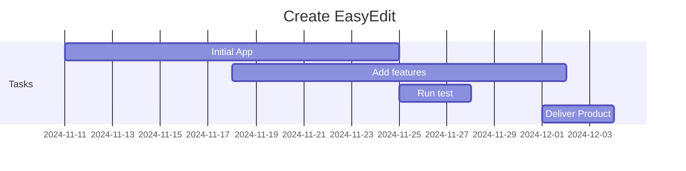

## *EasyEdit*


EasyEdit is an easy markdown editor that allows you to write Markdown (MD) and preview it in real-time. You can save, load .md files and export to HTML,TXT & PDF. The idea is to provide a single MD / Mermaid Aplication that can help creating MD documents by build the MD code as easy as a click of a button.

** *EasyEdit is a free and open-source project. You can use it for free and modify it as you like.* **

## *Latest Example implementing custom tables...*

<a> </a>

## *Install the project*
```
$ node --version
$ npm --version
$ git --version

$ git clone https://github.com/gcclinux/EasyEdit.git
$ cd EasyEdit
$ npm install
```

## *Run the Standalone Project*
```
$ npm start
```

## *Build as an standalone App (Windows & Linux)*
```
$ npm run electron:build
```

## *Pre-built packages*

&#x2713; [Linux x86_64] [EasyEdit-1.3.6-amd64.deb](https://github.com/gcclinux/EasyEdit/releases/download/1.3.6/EasyEdit-1.3.6-amd64.deb)  [ **[SHA256](## "88bace2c9146de14079739b3bb866d32b7197923860a671820eec0623a9b79c0 ")** ] [ 
**[MD5](## "373598a3a932c861165e9d86b2c2bb97 ")** ]   
&#x2713; [Linux x86_64] [EasyEdit-1.3.6-amd64.snap](https://github.com/gcclinux/EasyEdit/releases/download/1.3.6/EasyEdit-1.3.6-amd64.snap)  [ **[SHA256](## "bac57d55bf7c0f54cc9e6d5198b645c738497cf160035da58ec28e7c06f0cae4 ")** ] [ 
**[MD5](## "04df5329002e99ba772e6e0a4832e203 ")** ]   
&#x2713; [Linux x86_64] [EasyEdit-1.3.6-x86_64.AppImage](https://github.com/gcclinux/EasyEdit/releases/download/1.3.6/EasyEdit-1.3.6-x86_64.AppImage)  [ **[SHA256](## "27e67a41c10e756a766fb52421b6144334eaae7b9e5359146537c51c80b8b833 ")** ] [ 
**[MD5](## "27c6975d34d36003316c631820f096a6 ")** ]  
&#x2713; [Linux x86_64] [EasyEdit-1.3.6-x64.zip](https://github.com/gcclinux/EasyEdit/releases/download/1.3.6/EasyEdit-1.3.6-x64.zip)  [ **[SHA256](## "0bdb308531a2c6c332546e83821e3e7d03a924acb0b89837f626ca9ed2a69d9a ")** ] [ 
**[MD5](## "560cf22fb22400dbd45b61fba13f7dfd ")** ]  

&#x2713; [Linux aarch64] [EasyEdit-1.3.6-arm64.AppImage](https://github.com/gcclinux/EasyEdit/releases/download/1.3.6/EasyEdit-1.3.6-arm64.AppImage)  [ **[SHA256](## "b1665241c813f8683ccf818ae2aa9bd3463d2ca790d9ecb9d52202a45a5eb280 ")** ] [ 
**[MD5](## "618b4f4908c3eda43a0e097cd6743786 ")** ]  
&#x2713; [Linux aarch64] [EasyEdit-1.3.6-arm64.deb](https://github.com/gcclinux/EasyEdit/releases/download/1.3.6/EasyEdit-1.3.6-arm64.deb)  [ **[SHA256](## "dd3ddfbdb780c1b845db7827280d1970a695ae9c202dccf03d7a73853fdae8db ")** ] [ 
**[MD5](## "8d5e6d9308f3320b8657fb72371d96b4 ")** ]  
&#x2713; [Linux aarch64] [EasyEdit-1.3.6-arm64.snap](https://github.com/gcclinux/EasyEdit/releases/download/1.3.6/EasyEdit-1.3.6-arm64.snap)  [ **[SHA256](## "646ff9db40bcada396a12db6a5b05373d8e12909bb3dcecb7fea41e4f82f0ea2 ")** ] [ 
**[MD5](## "383ff6ac81d1317a0c57508e3528a2c7 ")** ]  
&#x2713; [Linux aarch64] [EasyEdit-1.3.6-arm64.zip](https://github.com/gcclinux/EasyEdit/releases/download/1.3.6/EasyEdit-1.3.6-arm64.zip)  [ **[SHA256](## "1f29261866f31f905be66cc61ccfe236609d49f80eb11a8b385472f17c096702 ")** ] [ 
**[MD5](## "d4f045384a949b250cad946a71a1cc4d ")** ]  

&#x2713; [Windows 64-bit] [EasyEdit-Setup.1.3.6.exe](https://github.com/gcclinux/EasyEdit/releases/download/1.3.6/EasyEdit-Setup.1.3.6.exe)  [ **[SHA256](## "8e137edc71b2cc27e3230e1b2d88ccfa5006bf1b93cda6945b9b3fae10618aaf ")** ] [ 
**[MD5](## "a352ad6387b85b2fda7aa788320f1f76 ")** ]  
&#x2713; [Windows 64-bit] [EasyEdit-Portable.1.3.6.exe](https://github.com/gcclinux/EasyEdit/releases/download/1.3.6/EasyEdit-Portable.1.3.6.exe)  [ **[SHA256](## "741b9b6e51377c16b3f905946f89b9723bd728531c0ea94594468d89d31945c3 ")** ] [ 
**[MD5](## "b0aeb90dbb8329b50604f3234d3ed906 ")** ]  
&#x2713; [Windows 64-bit] [EasyEdit-1.3.6-Win.zip](https://github.com/gcclinux/EasyEdit/releases/download/1.3.6/EasyEdit-1.3.6-Win.zip)  [ **[SHA256](## "62ee8f4cc390ecaf4b0bc22b6d954efe428a14844158ad04797c5d9e6caffec2 ")** ] [ 
**[MD5](## "087ce21866e927d5f91af00d635658d4 ")** ]  

&#x2713; [Darwin aarch64] [EasyEdit-1.3.6-arm64.dmg](https://github.com/gcclinux/EasyEdit/releases/download/1.3.6/EasyEdit-1.3.6-arm64.dmg)  [ **[SHA256](## "2d5957874c013a78502f8cac77bac9978a6ae9a8d812bc6c45234d1c9b0491a3 ")** ] [ 
**[MD5](## "e7aa350b49a72b3a5048e7f30804f78f ")** ]  
&#x2713; [Darwin aarch64] [EasyEdit-1.3.6-arm64-mac.zip](https://github.com/gcclinux/EasyEdit/releases/download/1.3.6/EasyEdit-1.3.6-arm64-mac.zip)  [ **[SHA256](## "103b9190615d28b6ddd6c6ee09df990ada70ef2be87833ad2f0cb6037352ec26 ")** ] [ 
**[MD5](## "8abf5aa75c6d38bd12fc7fc7a99acf8d ")** ]  

## *Example Gantt graph as code*


## *Example Table displayed*

| header1 | header2 | header3 |
| :--- | :--- | :--- |
| row1 | col2 | col3 |
| row2 | col2 | col3 |

## *Markdown Image URL Example & code*

[](https://github.com/gcclinux/EasyEdit)

```
[](https://github.com/gcclinux/EasyEdit)
```
