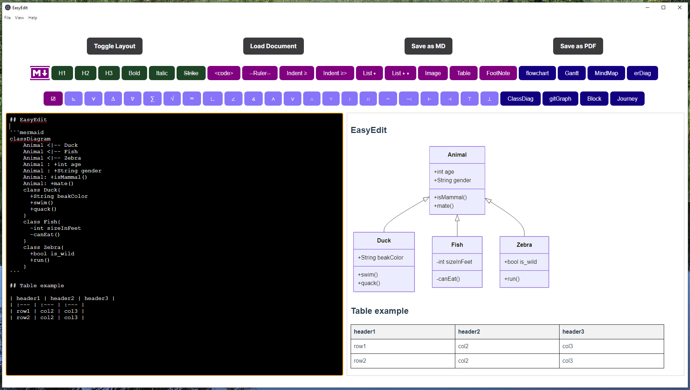
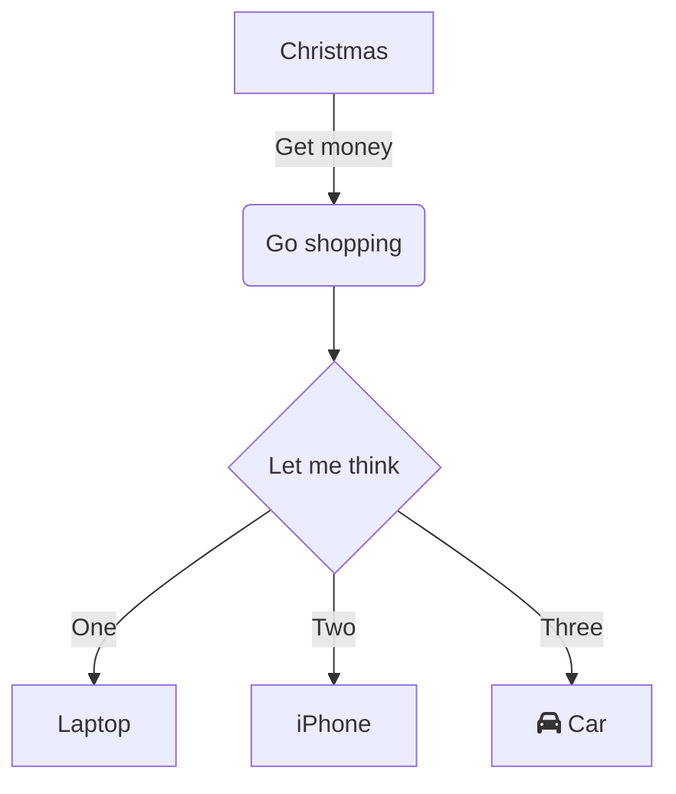

## EasyEdit

Required build dependacies

- - npm
- - vite
- - file-saver
- - html2canvas
- - jspdf
- - mermaid
- - react
- - react-dom
- - react-markdown
- - remark-gfm
- - electron



## Run the project

```
$ npm start
```

## Build an standalone App
```
$ npm run electron:build
```

## Mermeid example



## Tables as code
```

| header1 | header2 | header3 |
| :--- | :--- | :--- |
| row1 | col2 | col3 |
| row2 | col2 | col3 |

```

## Table displayed

| header1 | header2 | header3 |
| :--- | :--- | :--- |
| row1 | col2 | col3 |
| row2 | col2 | col3 |
