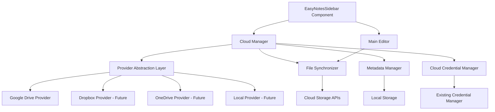

```mermaid
graph TB
    UI[EasyNotesSidebar Component] --> CM[Cloud Manager]
    CM --> PA[Provider Abstraction Layer]
    PA --> GP[Google Drive Provider]
    PA --> DP[Dropbox Provider - Future]
    PA --> OP[OneDrive Provider - Future]
    PA --> LP[Local Provider - Future]
    
    CM --> FS[File Synchronizer]
    CM --> MM[Metadata Manager]
    CM --> CCM[Cloud Credential Manager]
    
    CCM --> ECM[Existing Credential Manager]
    MM --> LS[Local Storage]
    FS --> CS[Cloud Storage APIs]
    
    UI --> ME[Main Editor]
    ME --> FS
```