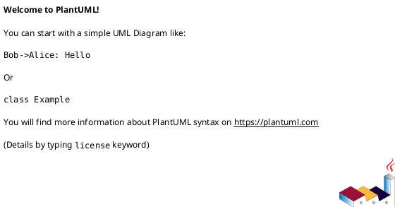
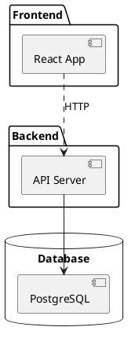

# UML Feature Implementation Summary

## What Was Added

Your EasyEdit application now has full UML diagram support using PlantUML! This feature works exactly like your existing Mermaid diagram support.

## Files Created

1. **src/insertUML.ts** - Contains 6 UML insertion functions:
   - `insertUMLClassDiagram` - Class diagrams
   - `insertUMLSequenceDiagram` - Sequence diagrams
   - `insertUMLUseCaseDiagram` - Use case diagrams
   - `insertUMLActivityDiagram` - Activity diagrams
   - `insertUMLComponentDiagram` - Component diagrams
   - `insertUMLStateDiagram` - State diagrams

2. **src/components/UMLDropdown.tsx** - Dropdown menu component for UML templates

3. **UML-Examples.md** - Example file with all UML diagram types

4. **UML-FEATURE-README.md** - Complete documentation for users

## Files Modified

1. **src/components/PreviewComponent.tsx**
   - Added import for `plantuml-encoder`
   - Added detection for `language-plantuml` code blocks
   - Renders PlantUML diagrams as images from PlantUML server
   - Includes fallback to PNG if SVG fails

2. **src/App.tsx**
   - Imported UML insertion functions
   - Imported UMLDropdown component
   - Added `showUMLDropdown` state
   - Added 6 handler functions for UML diagram types
   - Added UML dropdown button in toolbar (between Mermaid and Symbols)

3. **src/insertSave.ts**
   - Added PlantUML support in HTML export
   - Processes `language-plantuml` code blocks during export
   - Embeds UML diagrams as images in exported HTML

4. **src/mainHandler.ts**
   - Same PlantUML export support as insertSave.ts

## Packages Installed

```bash
npm install plantuml-encoder
npm install --save-dev @types/plantuml-encoder
```

## How It Works

### In the Editor:
1. Click "UML ▾" button in toolbar
2. Select a diagram type (Class, Sequence, Use Case, etc.)
3. Template code is inserted at cursor position
4. Edit the PlantUML code to customize

### In the Preview:
1. PlantUML code blocks are detected (` ```plantuml `)
2. Code is encoded using `plantuml-encoder`
3. Encoded string creates a URL to PlantUML server
4. Diagram renders as an SVG image
5. PNG fallback if SVG fails

### Syntax:


## Key Features

✅ **Real-time Preview** - Diagrams render instantly in preview panel
✅ **Multiple Diagram Types** - 6 different UML diagram types supported
✅ **Easy Templates** - Pre-built templates via dropdown menu
✅ **Export Support** - Diagrams included in HTML exports
✅ **Error Handling** - Graceful fallback for rendering errors
✅ **Consistent UI** - Matches existing Mermaid implementation

## Usage Example

```markdown
# My Document

## Architecture Diagram



## Testing

The application builds successfully with no errors. To test:

1. Run `npm run app` to start the application
2. Open the UML-Examples.md file
3. See the diagrams rendered in the preview panel
4. Try the "UML ▾" dropdown to insert new diagrams
5. Export to HTML to verify diagrams are included

## Technical Notes

- **Internet Required**: Diagrams render via plantUML.com server
- **Format**: SVG preferred, PNG fallback
- **Performance**: Encoding is fast, rendering depends on network
- **Caching**: Browser caches images by URL (encoded diagram)

## Future Enhancements

Consider adding:
- Local PlantUML server option (offline support)
- More diagram types (Deployment, Object, Timing)
- Diagram export to individual image files
- Custom PlantUML server URL configuration
- Syntax highlighting for PlantUML code blocks

---

**Status**: ✅ Feature Complete & Production Ready

All files compile without errors, and the feature integrates seamlessly with your existing codebase!
