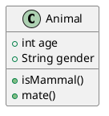
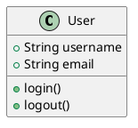
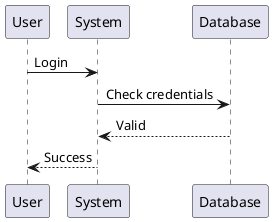
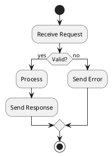
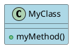

# Quick Start: UML Diagrams in EasyEditor

## Using the UML Feature

### Step 1: Find the UML Button
Look for the toolbar button labeled **"UML ▾"** - it's located right after the "Mermaid ▾" button.

### Step 2: Select a Diagram Type
Click the UML button to see these options:
- **Class Diagram** - Object-oriented class structures
- **Sequence Diagram** - Message flows between objects
- **Use Case Diagram** - Actor-system interactions
- **Activity Diagram** - Workflow and processes
- **Component Diagram** - System architecture
- **State Diagram** - State machines

### Step 3: Edit the Template
A code template will be inserted. It looks like this:

### Step 4: See It Rendered
The diagram appears instantly in the preview panel!

## Simple Examples

### Quick Class Diagram

### Quick Sequence Diagram

### Quick Activity Flow

## Pro Tips

1. **Always include** `@startuml` at the start and `@enduml` at the end
2. **Use the code fence** with `plantuml` language identifier
3. **Comments** start with a single quote `'`
4. **Preview updates** automatically as you type
5. **Export works** - diagrams are included in HTML exports

## Common Syntax

### Relationships
- `<|--` Inheritance
- `*--` Composition
- `o--` Aggregation
- `-->` Association
- `..>` Dependency

### Visibility
- `+` Public
- `-` Private
- `#` Protected
- `~` Package

### Colors

## Troubleshooting

**Diagram not showing?**
- Check you have `@startuml` and `@enduml`
- Verify the code fence uses `plantuml` language
- Make sure you have internet connection

**Syntax error?**
- PlantUML syntax is strict
- Check for missing colons, brackets, or keywords
- Try simplifying to find the error

**Slow rendering?**
- Large diagrams take longer to render
- Diagrams are fetched from plantUML.com
- Browser caches them for faster subsequent loads

---

That's it! You're ready to create professional UML diagrams in your markdown documents. 🎉
